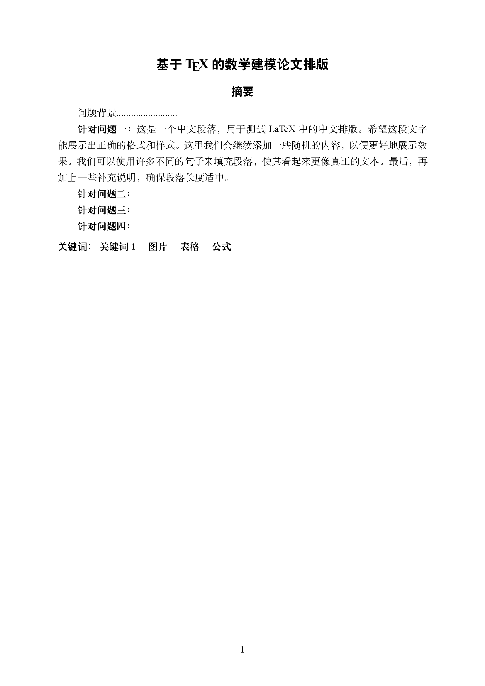
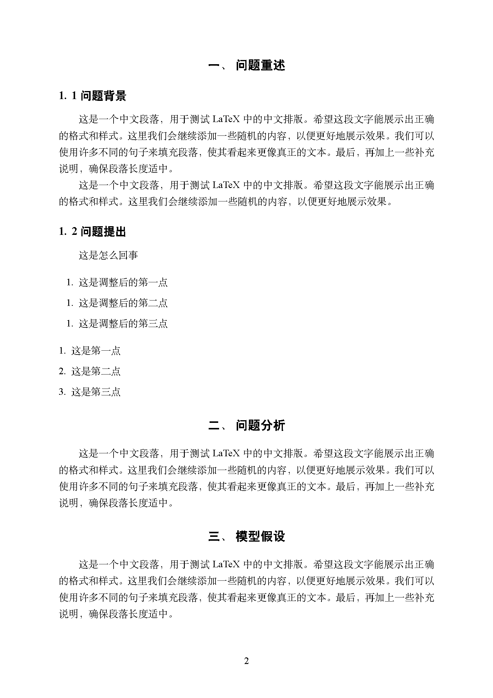
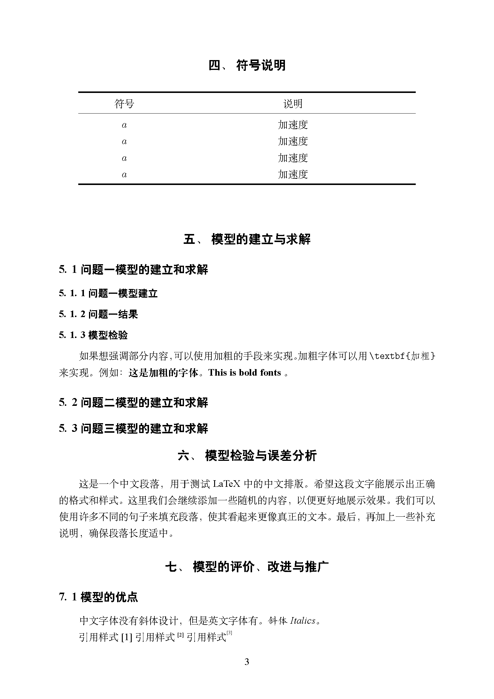
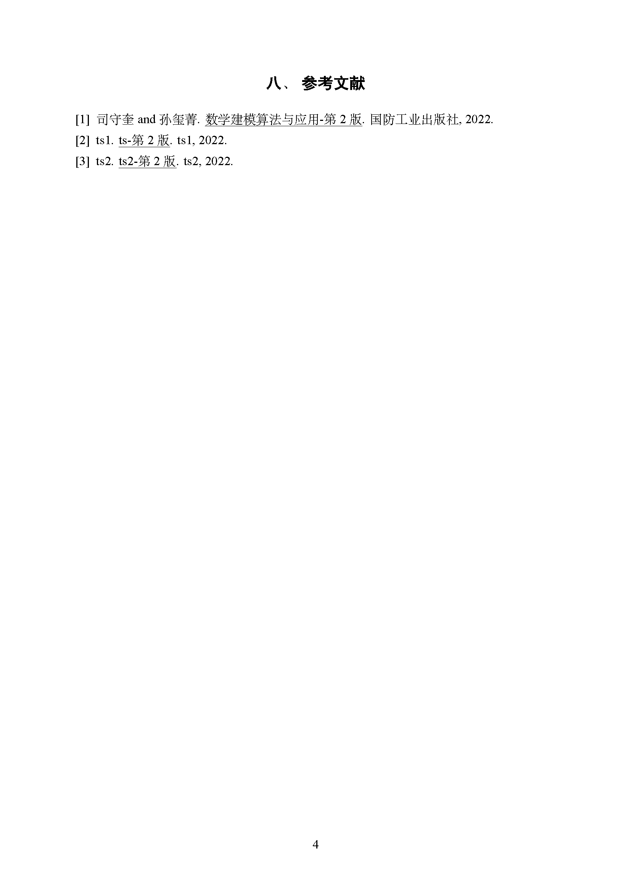
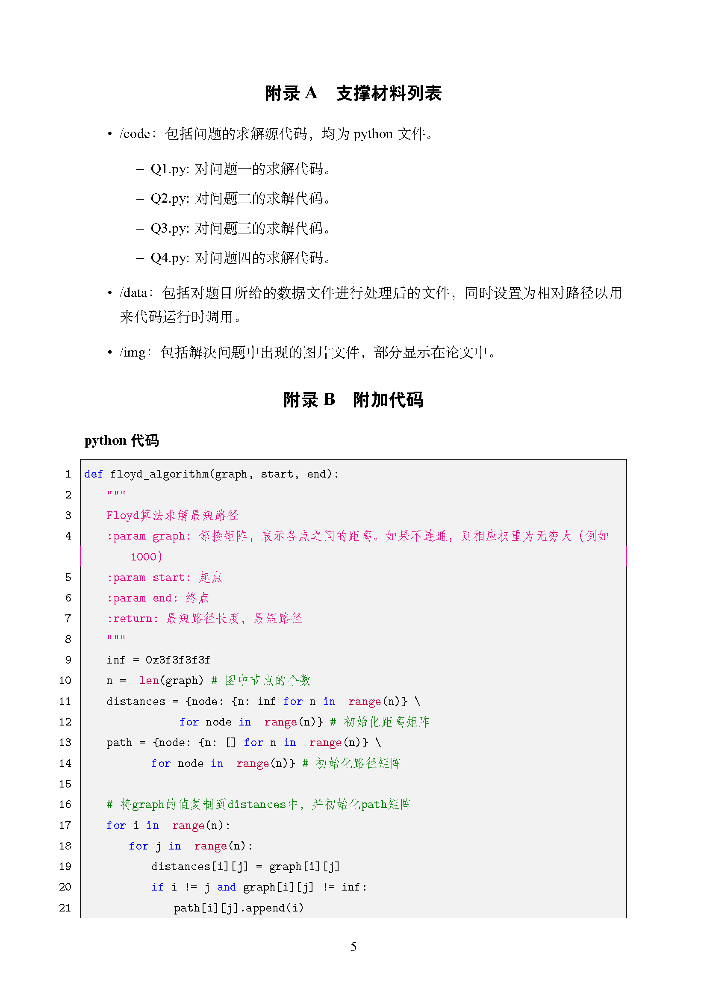

# 全国大学生数学竞赛 LaTex模板

该项目是高教杯全国大学生数学竞赛的latex模板，延续了一些他人模板的设置


## 建议环境

vscode + latexworkshop插件 + WSL环境

好用的插件：HyperSnips, WSL, Vim, GitHub Copilot, Ultra Math Preview

## Run

若无需参考文献、超链接，可用一次编译
```sh
rm -rf build && mkdir -p build && \
xelatex -output-directory=build main.tex
```

输出参考文献等需要4次编译
```sh
rm -rf build && mkdir -p build && \
xelatex -output-directory=build main.tex && \
bibtex build/main && \
xelatex -output-directory=build main.tex && \
xelatex -output-directory=build main.tex
```

## 展示






